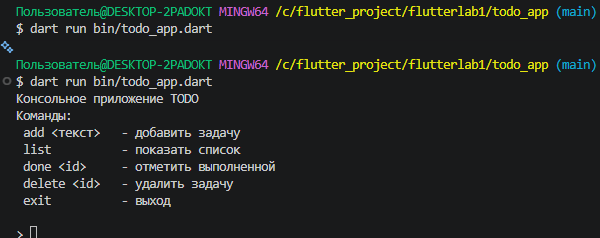

# Todo App — Flutter Lab 1

Консольное приложение для управления задачами, написанное на Dart

## Автор

- Имя: Павел
- Группа: ИСП-231

## Скриншот приложения

## Как запустить

1. Установить Dart SDK 3.0+
2. Клонировать репозиторий:
git clone <URL репозитория>
cd todo_app
3. Установить зависимости:
dart pub get
4. Запустить приложение:
dart run bin/todo_app.dart

## Что изучили

- Null Safety в Dart: разница между `String` и `String?`
- Переменные `final` и `const` и их отличия
- Именованные параметры и конструкторы в Dart
- Асинхронность: `Future`, `async/await`
- Работа с пакетами через `pub.dev`

## Ответы на вопросы

1. `final` - значение задаётся один раз во время выполнения. `const` — значение известно на этапе компиляции.
2. `String?` - nullable тип, переменная может содержать `null`.
3. `Future` - объект, который получит значение в будущем. `await` приостанавливает функцию не блокируя поток.
4. В Dart нет перегрузки конструкторов, поэтому именованные конструкторы позволяют создавать объекты разными способами.